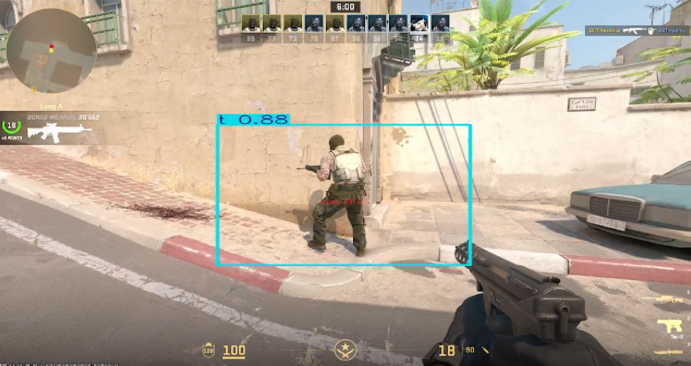

# 🔄 CS2 Dataset Generator

A Blender-based tool for generating synthetic datasets of CS2 character models from every angle.

   
  <em>Preview of all captured angles — individual renders compiled into a GIF (transparent background)</em>

   
  <em>YOLOv7 detecting a CS2 character in live gameplay (88% confidence), trained entirely on 210 synthetic images generated via automated multi-angle rendering.</em>

Using images generated by this script, a YOLOv7 model was trained to detect the character in live Counter-Strike 2 gameplay. This showcases the practical impact of high-quality synthetic datasets for computer vision tasks.

However, some limitations remain:

- The renders are generated **outside of the Source engine**.
- Post-processing effects such as **motion blur, depth of field, bloom, glow, and color grading** are not present.
- Dynamic lighting, ambient occlusion, and color temperature variations in real gameplay can affect detection accuracy.

---

## 🧰 What's Included

This project contains:

- A `.blend` file with a **placeholder model** and a scripted camera rig
- A Python script to automate **multi-angle rendering**
- Output images with **transparent backgrounds** for use in datasets

   
  <em>Blender setup: camera parented to an Empty object that rotates around the model</em>

---

## ⚙️ How It Works

1. The camera is **parented to an Empty** object.
2. A Python script rotates the Empty, orbiting the camera around the model.
3. Renders are taken at **incrementing Y and Z angles**.
4. Output is saved as `.png` files with **transparent backgrounds**.

This lets you easily composite renders over any background and train AI models on diverse views.

---

## 📁 Files

- `cs2_model.blend` – Blender file with model + camera setup
- `rotate_and_render.py` – Script to rotate and render at every angle
- `imgs/` – Sample renders, Blender previews, and detection results

---

## 💡 Use Cases

- Training AI models (YOLOv7, Detectron2, etc.)
- Synthetic dataset creation
- Viewpoint-agnostic model recognition
- Game modding / research

---

## 🛠 Requirements

- Blender 3.x
- Basic scripting knowledge in Blender (run via Scripting tab or CLI), and importing custom models.

---

## ⚠️ Legal Note

If you're forking and making this repository public, make sure to not include CS2 models (and other Valve assets) in the `.blend` file. Valve assets are copyrighted and **cannot legally be redistributed**.

---
