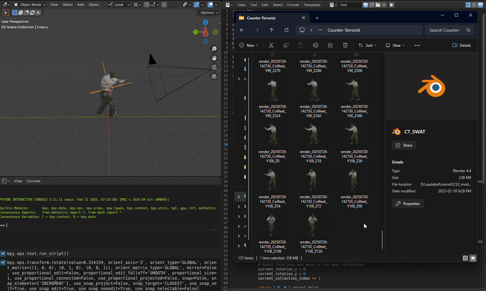

## 🔄 CS2 Dataset Generator

   
  <em>Preview of all captured angles. Individual renders compiled into a GIF (with transparent background)</em>

# CS2 Model Rotator (Blender Script for Dataset Generation)

This repository contains a **.blend file of a CS2 terrorist model** rigged with a camera system designed for **automated multi-angle rendering**. The purpose is to generate synthetic datasets by capturing the model from every meaningful view with a transparent background.

## 🔄 How It Works

- A **camera is parented to an Empty** object.
- A Python script rotates the Empty, causing the camera to rotate around the model.
- The script renders the model at **incrementing Y and Z angles**, producing a full set of transparent PNG images.

This setup allows for easy insertion of rendered images into other scenes or backgrounds, ideal for training computer vision models or creating synthetic datasets.

## 📁 Files

- `cs2_model.blend` – Blender file with CS2 model and camera setup.
- `rotate_and_render.py` – Script to rotate the camera and render PNGs.
- `imgs/` – Sample renders and previews.

## 🧠 Use Cases

- AI model training (e.g., model recognition/classification)
- Synthetic image generation
- Dataset augmentation

## ⚙️ Requirements

- Blender (tested with version 3.x)
- Basic familiarity with scripting in Blender (run Python script from Scripting tab)

---

